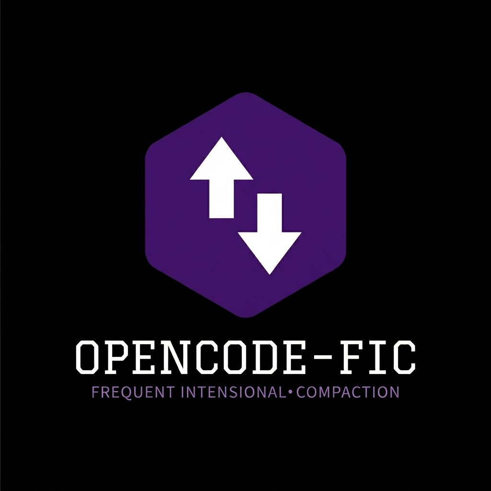

# OpenCode FIC Infrastructure



Frequent Intentional Compaction workflow for OpenCode — structured context engineering
for AI coding agents tackling hard problems in complex codebases. Based on Ideas and philosophy from HumanLayer/CodeLayer. A simple implementation to easily plug right into OpenCode Projects.

## Install into your project

```bash
git clone <this-repo> opencode-fic
cd opencode-fic
./setup-fic.sh /path/to/your/project
```

Or copy the contents manually.

## What's included

```
.opencode/
  opencode.json              — agent permissions and config wiring
  agents/
    researcher.md            — read-only Phase 1 researcher subagent
    planner.md               — Phase 2 planner (primary agent)
  commands/
    research.md              — /research [topic]
    plan.md                  — /plan [research-doc]
    implement.md             — /implement [plan-doc]
    checkpoint.md            — /checkpoint [topic]
    commit.md                — /commit
    pr.md                    — /pr [plan-doc]
  skills/
    fic-workflow/SKILL.md    — full FIC methodology reference (loaded on demand)

agent_docs/                  — fill these in for your project
  architecture.md
  testing.md
  conventions.md

AGENTS.md                    — lean root config (fill in your project details)
thoughts/ → ~/thoughts/<project>  — research/plan/progress artifacts (gitignored)
```

## The Workflow

### Core idea
LLMs are stateless. Every session starts from zero. The FIC workflow externalizes
state into markdown files so each phase starts with a clean, correctly-scoped context.

**Error compounding:**
- Bad research → thousands of bad lines of code
- Bad plan → hundreds of bad lines
- Bad code → one bad line

Review the 400-line research+plan artifacts, not the 2000-line generated code.

### Recommended Session Flow

1. **Research phase** — Run `/research [topic]` in the default build agent
2. **Planning phase** — Switch to the planner agent, then run `/plan thoughts/research/[research-doc].md` (can be same session, but recommended to run `/new` for fresh context)
3. **Implementation phase** — Create a new session, then run `/implement thoughts/plans/[plan-doc].md` in the build agent

Starting a new session before `/plan` and `/implement` keeps context fresh and avoids hitting the 60% context limit.

### Phase 1: Research
```
/research fix the payment retry bug
```
Runs in an isolated researcher subagent. Uses `@explore` for all file reads.
Produces `thoughts/research/YYYY-MM-DD_[topic]-research.md`.
**Review the doc before proceeding.**

### Phase 2: Plan
```
/plan thoughts/research/2025-01-15_payment-retry-research.md
```
Runs in the planner agent (a primary agent in OpenCode — not the build agent).
Reads your research doc, asks clarifying
questions, then produces `thoughts/plans/YYYY-MM-DD_[topic]-plan.md`.
**Review and approve the plan before implementing.**

### Phase 3: Implement
```
/implement thoughts/plans/2025-01-15_payment-retry-plan.md
```
Runs in build agent. Executes phase by phase, runs tests, waits for your
manual verification between phases. Updates checkboxes in the plan as it goes.

### Pause and resume
```
/checkpoint payment-retry
```
Saves full session state to `thoughts/progress/payment-retry-progress.md`.
Start a new session and resume with:
```
/implement thoughts/plans/payment-retry-plan.md
[read the progress doc at thoughts/progress/payment-retry-progress.md first,
phase 1 is done, start phase 2]
```

### Finishing up
```
/commit
/pr thoughts/plans/payment-retry-plan.md
```

## Setup checklist

After running `setup-fic.sh`:

- [ ] Edit `AGENTS.md` — fill in What, Stack, and test commands
- [ ] Edit `agent_docs/architecture.md` — map your codebase
- [ ] Edit `agent_docs/testing.md` — real test commands
- [ ] Edit `agent_docs/conventions.md` — real patterns
- [ ] Review `.opencode/opencode.json` — adjust test commands in bash permissions
- [ ] Optionally set model overrides per agent in `opencode.json`

## Key rules to internalize

1. **Never exceed 60% context in any session** — start fresh before you hit the wall
2. **Start a new session at every phase boundary** — research → plan → implement → done
3. **State lives in `thoughts/`** — not in the conversation
4. **Review before proceeding** — research doc before planning, plan before implementing
5. **Surface divergences immediately** — agents must not silently improvise around plan mismatches
